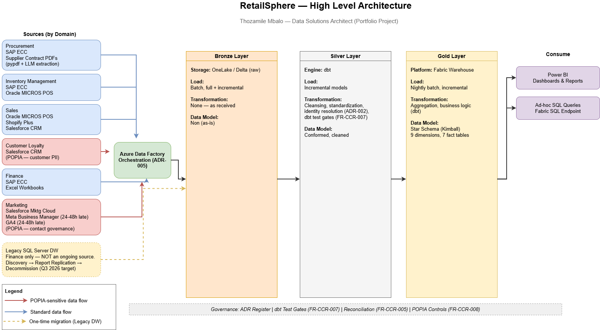

# RetailSphere (Pty) Ltd — Data Platform Design and Build

## About This Project

A complete end-to-end data platform design and build project
for a fictional South African multi-channel retail group.

**Architect:** Thozamile Mbalo  
**Role:** Data Solutions Architect (Portfolio Project)  
**Start Date:** April 2026  
**Target Completion:** February 2027  

## Why This Project Exists

To design and build a modern data platform from the ground up —
solving real business problems including data silos, late arriving
data, legacy migrations, and data governance.

To develop the confidence to apply these skills in real life
as a Data Solutions Architect.

To prove — with working code and complete documentation —
that I can handle complex technical design AND difficult
stakeholder engagements simultaneously.

## High Level Architecture

## Glossary

New to data engineering terms? See [glossary.md](docs/glossary.md) for
plain-English definitions of everything technical used in this repository.

## Company Overview

RetailSphere (Pty) Ltd is a fictional South African
multi-channel retail group with:
- R4.2 billion annual revenue
- 87 stores nationally
- Clothing, homeware, and electronics categories
- 2.1 million loyalty members
- 10 source systems

## The 18-Step Framework

### Phase 1 — Design (Steps 1-12)
| Step | Name | Status | Deliverable |
|------|------|--------|-------------|
| 1 | Domain Identification | ✅ Complete | BDR-001 v1.3 |
| 2 | Business Process Analysis | ✅ Complete | BPA-001 |
| 3 | Functional Requirements | ✅ Complete | FRD-001 |
| 4 | Non-Functional Requirements | ✅ Complete | NFR-001 |
| 5 | Source System Investigation | ✅ Complete | SSI-001 |
| 6 | Risk Analysis and ADRs | ✅ Complete | ADR-REG-001 v2.0 + ADRs |
| 7 | Dimensional Model Design | ✅ Complete | DM-001 v1.0 --> v1.1|
| 8 | Source to Target Mapping | ✅ Complete | STM-001 |
| 9 | Physical Database Design | ✅ Complete | PDD-001 |
| 10 | Data Integration Design | ✅ Complete | DID-001 |
| 11 | Metadata Strategy | 🔄 In Progress | Metadata doc |
| 12 | Testing Strategy | ⬜ Not Started | Test plan |

### Phase 2 — Build (Steps 13-18)
| Step | Name | Status | Deliverable |
|------|------|--------|-------------|
| 13 | Build Bronze Layer | ⬜ Not Started | Python + DDL |
| 14 | Build Silver Layer | ⬜ Not Started | dbt models |
| 15 | Build Gold Layer | ⬜ Not Started | Star schema |
| 16 | Pipeline Orchestration | ⬜ Not Started | ADF pipelines |
| 17 | Reporting and Dashboards | ⬜ Not Started | Power BI |
| 18 | Showcase and Deployment | ⬜ Not Started | Live platform |

## Technology Stack

| Layer | Tool |
|-------|------|
| Language | Python, SQL, YAML |
| Transformation | dbt |
| Database | SQL Server + Microsoft Fabric Warehouse |
| Orchestration | Azure Data Factory |
| Reporting | Power BI |
| Version Control | Git + GitHub |
| Documentation | Word + draw.io + dbt docs |

## Folder Structure
- docs/          Design documents — one folder per step
- src/           Source code — Bronze, Silver, Gold, Pipelines
- data/          Sample data and generators
- reports/       Power BI files
- diagrams/      Architecture diagrams

## Business Domains

| Domain | Process Owner | Source Systems |
|--------|--------------|----------------|
| Procurement | Sipho Dlamini | SAP ECC, Supplier Contract PDFs |
| Inventory Management | Zanele Mokoena | SAP ECC, Oracle MICROS POS |
| Sales | Rethabile Sithole | Oracle MICROS POS, Shopify, Salesforce CRM |
| Customer Loyalty | Priya Naidoo | Salesforce CRM |
| Finance | Johan van der Merwe | SAP ECC, Excel |
| Marketing | Rethabile Sithole | Marketing Cloud, Meta, GA4 |

*Note: SQL Server Legacy DW and Supplier Contract PDFs are both part of SSI-001's 10 investigated source systems. Legacy DW is decommission-bound (see ADR register) and does not feed any active domain build.*

## Critical Architecture Decisions

| ADR | Title | Status |
|-----|-------|--------|
| ADR-001 | Master Product Identifier Strategy | APPROVED |
| ADR-002 | Unified Customer Identity Resolution | IN PROGRESS |
| ADR-003 | Supplier Contract PDF Extraction | IN PROGRESS |
| ADR-004 | Medallion Architecture Layer Design | APPROVED |
| ADR-005 | Orchestration and Pipeline Strategy | APPROVED |
| ADR-006 | Marketing Attribution Logic | IN PROGRESS |
| ADR-007 | Contact Governance and Opt-out | IN PROGRESS |

---
*This is a portfolio project using fictional data and scenarios.*
*No real company data is used.*